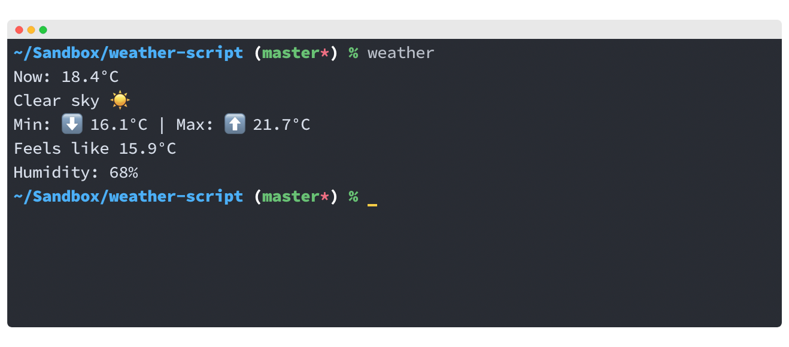

# Weather CLI

[](./screenshot.png)

I found out about the `curl wttr.in/London` method to get the current temperature in the command line, and wanted to customise it a bit. 

## Setup & usage

```bash
git clone https://github.com/nkhil/weather-script.git
cd weather-script
npm install
node index.js
```

